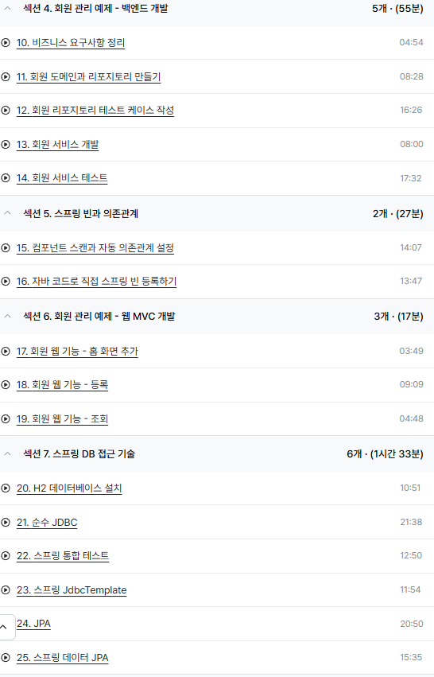

#### 바닐라 자바의 한계
순수 자바로 개발하다 보면 객체지향의 장점을 충분히 살리기 어렵다.  
비즈니스 로직과 반복되는 공통 기능이 뒤섞이고, 데이터베이스나 외부 기술 스택이 바뀔 때마다 코드 전체를 수정해야 한다.  
스프링은 이런 문제를 해결하기 위해 POJO 프로그래밍을 지원하며, 핵심 개념으로 IoC/DI, AOP, PSA를 제공한다.  

---

#### IoC / DI (제어의 역전과 의존성 주입)
- IoC(Inversion of Control)는 객체 생성과 생명주기를 개발자가 직접 관리하지 않고, 스프링 컨테이너가 대신 관리하도록 하는 개념이다.  
- DI(Dependency Injection)는 필요한 의존성을 외부에서 주입받는 방식으로, 코드 간 결합도를 낮추고 테스트 용이성을 높인다.  

즉, 객체 관리의 주체를 프레임워크로 넘김으로써 애플리케이션은 핵심 로직에만 집중할 수 있다.  

---

#### AOP (관심 지향 프로그래밍)
애플리케이션에는 비즈니스 로직(핵심 관심사) 외에도 로깅, 보안, 트랜잭션 처리(공통 관심사) 같은 코드가 함께 얽혀 있다.  
이 코드들이 뒤섞이면 중복이 발생하고, 변경 시 전체를 수정해야 하는 문제가 생긴다.  

AOP는 공통 관심사를 별도의 모듈로 분리해 관리한다.  
핵심 로직은 그대로 두고, 공통 기능은 횡단 관심사로 분리하여 재사용할 수 있게 된다.  

---

#### PSA (일관된 서비스 추상화)
스프링은 다양한 기술 스택을 동일한 방식으로 사용할 수 있도록 추상화 계층을 제공한다.  
대표적인 예시가 JDBC이다.  

- 데이터베이스 벤더마다 드라이버는 다르지만, 스프링은 JDBC라는 인터페이스를 통해 일관된 접근 방식을 제공한다.  
- 따라서 DB를 교체하더라도 기존 로직 대부분을 수정하지 않고 그대로 재사용할 수 있다.  

이처럼 스프링은 특정 기술에 종속되지 않도록 **서비스 추상화**를 지원한다.  

---

#### 스프링의 사이클
스프링을 이해할 때, 위 개념들을 세세히 다 아는 것보다 **큰 그림(사이클)**을 먼저 잡는 것이 중요하다.  

스프링은 객체 생성 → 의존성 주입 → 실행 → 공통 기능 적용 → 결과 반환이라는 흐름 속에서,  
객체지향 프로그래밍의 장점을 극대화하도록 설계되어 있다.  
최근에는 스프링 부트를 통해 이러한 사이클을 더 간단히 구성할 수도 있다.  

---

#### 정리
스프링은 객체지향 원리를 살리기 위해 IoC/DI, AOP, PSA라는 세 가지 축을 제공한다.  
이 개념들을 활용하면 코드의 재사용성과 유지보수성이 크게 향상된다.  
개발자는 먼저 전체적인 사이클을 이해한 뒤, 각 개념을 점진적으로 적용하면서 스프링의 장점을 체감하는 것이 좋다.  

요즘은 스프링부트로도 많이 사용한다고 한다

---
참고자료
- [공식문서](https://spring.io/projects)
- [스프링에대해서](https://www.codestates.com/blog/content/%EC%8A%A4%ED%94%84%EB%A7%81-%EC%8A%A4%ED%94%84%EB%A7%81%EB%B6%80%ED%8A%B8)
- [스프링생태계](https://ch-tech.tistory.com/17)
- [스프링구성요소1](https://devscb.tistory.com/119)
- [스프링구성요소2](https://ajdxjdrnfld.tistory.com/9)
